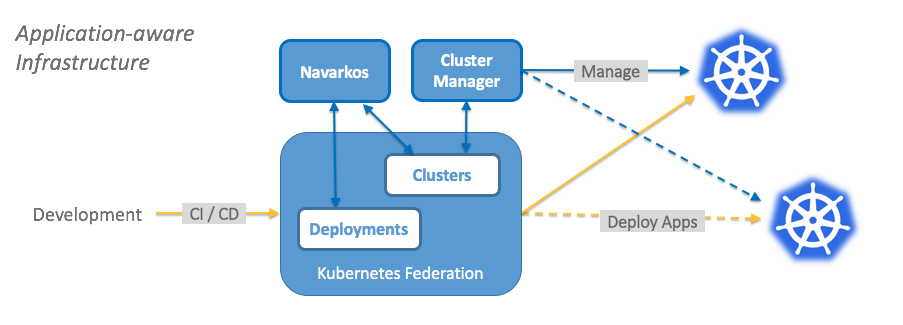

# Navarkos

Navarkos acts as a mediator between demand (deployment replicas) and supply (federated clusters). When you are deploying an application to a group of clusters, you need a way to distribute replicas of that application to multiple clusters. Navarkos helps in re-balancing replica allocation among clusters to optimize usage or load by analyzing:

 -	what clusters are there and how they are currently used for applications,
 -	how much capacity must be allocated for each cluster, and
 -	which cluster is best suited for the application.

Navarkos is best used in tandem with [cluster-manager](https://github.com/oracle/cluster-manager) to help re-balance demand by performing life cycle operations on clusters, which is achieved either by provisioning more capacity (Provision/Scale up) or removing excessive allocated capacity (Scale Down/Shutdown) i.e. its provides application-aware infrastructure.

## Before You Begin

The [default Scheduling](https://kubernetes.io/docs/tasks/administer-federation/deployment/#spreading-replicas-in-underlying-cluster) provided as part of the [Federation project](https://github.com/kubernetes/federation) distributes replica equally among Federated clusters, but it doesn't provide application-aware infrastructure.

Navarkos works on re-balancing, after initial equal distribution and persists that by updating [ReplicaAllocationPreferences](https://github.com/kubernetes/federation/blob/master/apis/federation/types.go) annotation on the deployment.

 

<figcaption>Figure:1 Navarkos with cluster-manager Architecture</figcaption>
 

The above architecture diagram shows how Navarkos works with cluster-manager. Navarkos communicates with cluster-manager for life cycle operations by requesting state change in the form of a cluster annotation.

When used with cluster-manager, Navarkos provides following advantages over default scheduling:

- **Consistency**: Cluster capabilities consistency (ingress, nodes, network)
- **Manageability**: Automated cluster life-cycle management
- **Portability**: Trivially move workloads from one set of clusters to another
- **Cost**: offline when idle, scale workload with application awareness
- **Compliance**: Ensure application is run where and how it needs to be
- **Multi-cloud**: Manage application independently of cloud provider
- **Global Scale**: Run your application wherever there is demand
- **Hybrid**: Allows for private & public clusters to work together dynamically

## Build

requirements:

- Go 1.8.x (Note: Go 1.9 with glide will have nested dependency errors on `glide up -v`)
- Glide 0.12+ (0.12.3 and 0.13.0 are the tested versions)
- Docker (Multi-stage builds requires Docker 17.05 or higher on the daemon and client.)

get source:
- `export K8S_INCUBATOR_DIR="$GOPATH/src/github.com/kubernetes-incubator"`
- `mkdir -p $K8S_INCUBATOR_DIR`
- `cd $K8S_INCUBATOR_DIR`
- `git clone https://github.com/oracle/navarkos`

build:
- `make build-local` will clean up, builds the navarkos binary and runs locally.
- `make build-image` will invoke 'build-local' and builds navarkos docker image, which is suitable for deploying to Kubernetes.
- `make build-docker` will cleanup and builds docker image containing navarkos binary, which is suitable for deploying to Kubernetes. Resultant docker image is produced using the multi-stage build docker file.
- `make check` will fmt, vet and unit test the code.

## Deploy

Follow [deploy instructions](deploy/README.md) to deploy Navarkos.

## How to use

Learn how to use Navarkos with an [example](examples/README.md).

## Community, discussion, contribution, and support

Learn how to engage with the Kubernetes community on the [community page](http://kubernetes.io/community/).

You can reach the maintainers of this project at:

- Slack: tbd
- Mailing List: tbd
- [OWNERS](OWNERS) file has the project leads listed.

Contributions to this code are welcome!

Refer to [CONTRIBUTING.md](CONTRIBUTING.md) and [LICENSE](LICENSE) on how to contribute to the project.
Refer to [RELEASE.md](RELEASE.md) about the process of release of this project.

## Kubernetes Incubator

This is a pending proposal for [Kubernetes Incubator project](https://github.com/kubernetes/community/blob/master/incubator.md). The project was established 2017-12-05. The incubator team for the project is:

- Sponsor: tbd
- Champion: tbd
- SIG: tbd

## Code of conduct

Participation in the Kubernetes community is governed by the [Kubernetes Code of Conduct](code-of-conduct.md).
